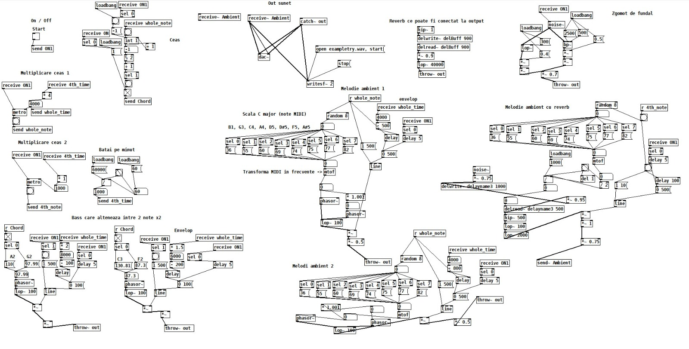

# Soft Body Simulation

<a href="https://youtu.be/zXxs5zkcds4" style = "font-size: 30px; color: darkblue; font-weight: bold;">Watch the demo!</a>
This application present a softbody simulation featuring a control panel that allows experimenting with various parameters related to the body's characteristics.

The user can choose between shapes such as circle, oval, square, rectangle and triangle for the body, and then modify features such as the body's stiffnes, damping, bounce and soil friction, while observing the ways in which the body deforms on contact with walls. The user can also pick up the object and drag it around to observe the deformation.

The project features music created using Pure Data, which can be toggled on and off by using a checkbox. Just listen, it's really a masterpiece!

### Physics

The physics engine is built in Three.js using [this article](https://lisyarus.github.io/blog/posts/soft-body-physics.html) as a reference, implemented using shape matching, where the points of the body actively attempt to go back to their original position when pushed, leading to a soft body mechanism. The physics engine was built by Robert Takacs.

### Control panel

The control panel allows choosing different types of objects, varying their properties (width, length, number of points per side. triangle angle), and varying common simulation properties, choosing to show or not the "skeleton" of the object, and whether to play or not the music. The control panel was built by Raluca Chiriac.

### Music

The music of the application was built using Pure Data, by Lucia Constantin and Sebastian Colț. Documentation presented in Romanian.

#### Tema

Proiectul consta in generarea unei melodii ambientale in Pure Data pentru un soft body simulation, folosindu-ne de componente audio foarte populare.

### Tehnologii utilizate

- Pure Data
- MIDI
- Detune folosind osciloatore
- Filtre low-pass pentru sunete inalte
- Enevelope-uri
- Reverb
- Efecte de zgomot de fundal (pink noise)

### Componentele melodiei

#### Componeta de input

Are rolul de a trimite folosind obiectul send~ un semnal de start catre toate componente

### Componentele de sunet ambiant

#### Ambient 1

- Este un generator de sunete ambientale
- Sunt utilizate sunete din scallel F, C si G major, redate sub forma notelor MIDI
- La fiecare pas este aleasa aleator o nota dintre cele 8 disponibile, si este convertita in frecventa
- Rezultatul acesteia este utilizat pentru generarea unui sunet cu ajutorul a doua oscilatoare cu valori foarte apropiate in frecventa pentru a creea un efect de detune
-   Sunetul generat este apoi filtrat folosind un filtru low-pass pentru a taia frecventele inalte
-   Asupra semnalului se va aplica si un envelope care are scopul ca nota sa intre gradual, sa se mentina o perioada scurta si sa dispara lent (atac si release fiind egale = 500)

#### Ambient 2

- Este construit pe ambient 1
- Foloseste frecvente mai joase pentru oscilatoare
- Iar duarata notelor este mai mare (800)

#### Ambient cu reverb

- Foloseste ca baza principiile de la componenta ambient 1
- Este adaugata o componete de reverb asupra notelor
- Iar pe fundal este alaturat un zgomot de fundal

### Componenta de bass

- Alterneaza intre doua perechi de cate 2 frecvente: A2 si G2, respectiv C3 si F2
- Oscilator simplu pentru generearea semnalului
- Envelope aplicat pe fiecare nota

### Componenta de ceas

- Prin BPM, impartim bitul la 60000 de milisecunde, adica un minut, obtinand astfel lungimea unei patrimi de nota
- Multiplicarile sunt folosite pentru a obtine lungimea unei note intregi, respectiv a unei patrimi de nota
- La fiecare 2 masuri, ceasul va alterna notele din structurile pentru bass, fapt indicat prin toggle-ul atasat la finalul acestuia

### Componenta de zgomot

- Este un zgomot de fundal realizat prin aplicarea unor filtre low-pass si band-pass, care sunt combinate pentru a obtine un zgomot de fundal

### Componenta de output

- Deoarece melodia finala este alcatuita din mai multe componente, pentru a le strange pe toate intr-un singur semnal, am folosit obiectul throw~ denumit out pentru fiecare componenta
- Componenta catch~ strange toate compoentele, iar semnaul final este salvat intr-un fisier audio de tip .wav



## Run the project

Because the project uses JavaScript modules, you must run it through a local server (not `file://`).

From the project folder:

```bash
python3 -m http.server 8000
```

Then open:

```
http://localhost:8000
```

---

## Project structure

```
project/
  index.html
  main.js
  ShapeFactory.js
  SoftBody.js
  SoftBodyPoint.js
  utils.js
```

---

## Creating shapes

Shapes are generated using `ShapeFactory`.

---

### Circle

```js
ShapeFactory.circle(pointCount, radius);
```

Example:

```js
shape: ShapeFactory.circle(24, 2.5);
```

| Parameter  | Meaning          |
| ---------- | ---------------- |
| pointCount | Number of points |
| radius     | Circle radius    |

---

### Oval

```js
ShapeFactory.oval(pointCount, radiusX, radiusY);
```

Example:

```js
shape: ShapeFactory.oval(24, 2.5, 5);
```

| Parameter  | Meaning           |
| ---------- | ----------------- |
| pointCount | Number of points  |
| radiusX    | Horizontal radius |
| radiusY    | Vertical radius   |

---

### Square

```js
ShapeFactory.square(size, pointsPerEdge);
```

Example:

```js
shape: ShapeFactory.square(4, 8);
```

| Parameter     | Meaning         |
| ------------- | --------------- |
| size          | Width/height    |
| pointsPerEdge | Points per edge |

Total points:

```
4 * pointsPerEdge
```

### Rectangle

```js
ShapeFactory.rectangle(width, height, pointsPerEdge);
```

Example:

```js
shape: ShapeFactory.rectangle(4, 6, 8);
```

| Parameter     | Meaning                   |
| ------------- | ------------------------- |
| width         | Width                     |
| height        | Height                    |
| pointsPerEdge | Points per rectangle edge |

Total points:

```
4 * pointsPerEdge
```

---

### Triangle

```js
ShapeFactory.triangle(radius, smallAngle, pointsPerEdge);
```

Example:

```js
shape: ShapeFactory.triangle(3, 25, 8);
```

| Parameter     | Meaning                              |
| ------------- | ------------------------------------ |
| radius        | Distance from center to corner       |
| smallAngle    | The angle of the top of the triangle |
| pointsPerEdge | Points per edge                      |

Total points:

```
3 * pointsPerEdge
```

---

### Equilateral Triangle

```js
ShapeFactory.triangleEquilateral(radius, pointsPerEdge);
```

Example:

```js
shape: ShapeFactory.triangleEquilateral(3, 8);
```

| Parameter     | Meaning                        |
| ------------- | ------------------------------ |
| radius        | Distance from center to corner |
| pointsPerEdge | Points per edge                |

Total points:

```
3 * pointsPerEdge
```

---

## Creating a soft body

```js
const body = new SoftBody({
  shape: ShapeFactory.circle(24, 2.5),
  center: new THREE.Vector2(0, 4),
  shapeStiffness: 80,
  shapeDamping: 8,
  gravity: new THREE.Vector2(0, -20),
  bounce: 0.5,
  friction: 8,
});
```

Add to scene:

```js
body.addToScene(scene);
```

---

## SoftBody parameters

| Parameter      | Meaning                                | Example                     |
| -------------- | -------------------------------------- | --------------------------- |
| shape          | Shape points                           | `ShapeFactory.circle(...)`  |
| center         | Initial position                       | `new THREE.Vector2(0, 4)`   |
| rotation       | Initial rotation                       | `Math.PI / 4`               |
| shapeStiffness | Shape recovery strength                | `80`                        |
| shapeDamping   | Internal damping                       | `8`                         |
| gravity        | Gravity force                          | `new THREE.Vector2(0, -20)` |
| bounce         | Bounce on walls                        | `0.5`                       |
| friction       | Floor friction                         | `8`                         |
| filled         | Show the body as a filled block ?      | `true`                      |
| fillColor      | The color with which to fill the block | `0xff0000`                  |
| fillOpacity    | The Opacity of the fill color          | `0.5       `                |
| showPoints     | Show the point mesh of the body        | `true`                      |

---

## Tuning

### More rigid

```js
shapeStiffness: 150,
shapeDamping: 15,
```

### More soft / jelly

```js
shapeStiffness: 40,
shapeDamping: 3,
```

### Strong gravity

```js
gravity: new THREE.Vector2(0, -40),
```

### No gravity

```js
gravity: new THREE.Vector2(0, 0),
```

---

## Multiple bodies

```js
const bodies = [
  new SoftBody({
    shape: ShapeFactory.circle(24, 2.5),
    center: new THREE.Vector2(-5, 4),
  }),

  new SoftBody({
    shape: ShapeFactory.square(4, 8),
    center: new THREE.Vector2(0, 4),
  }),

  new SoftBody({
    shape: ShapeFactory.triangle(3, 8),
    center: new THREE.Vector2(5, 4),
  }),
];

for (const body of bodies) {
  body.addToScene(scene);
}
```

## Dragging (mouse interaction)

Dragging is handled by a separate `DragController`, which applies forces to nearby points when you click and pull a body.

### Parameters

```js
const dragController = new DragController({
  stiffness: 250,
  damping: 25,
  maxDistance: 2,
  affectedRange: 999,
});
```

| Parameter       | Meaning                                    |
| --------------- | ------------------------------------------ |
| `stiffness`     | How strongly the point follows the mouse   |
| `damping`       | Reduces oscillation while dragging         |
| `maxDistance`   | Max distance from mouse to grab a point    |
| `affectedRange` | How many neighboring points are influenced |

---

### Behavior

- Clicking near a body grabs the closest point
- Dragging pulls that point
- Neighboring points are also influenced (for smooth deformation)

`affectedRange` is automatically clamped to:

```js
floor(pointCount / 4);
```

So large bodies feel soft, and small ones stay stable.

---

### Tuning

#### Strong / tight grab

```js
stiffness: 400,
damping: 40,
```

#### Soft / jelly drag

```js
stiffness: 120,
damping: 10,
```

#### Wide influence

```js
affectedRange: 999; // (auto-limited internally)
```

#### Precise grab

```js
maxDistance: 1.0;
```

---

### Notes

- Dragging applies **forces**, not teleportation -> natural physics behavior
- Works together with shape matching -> body keeps its structure
- Too high stiffness + low damping -> jitter / instability

## Stats for WebPD

Accessible through `SoftBody.stats`

| Stat     | Meaning                                                                     | Range |
| -------- | --------------------------------------------------------------------------- | ----- |
| `speed`  | How fast the object is moving                                               | 0+    |
| `force`  | How much force is exerted in total on the object                            | 0+    |
| `stress` | How deformed the object is compared to its normal area                      | 0-1   |
| `panic`  | A value of how much action has happened on the object in the past 3 seconds | 0+    |
